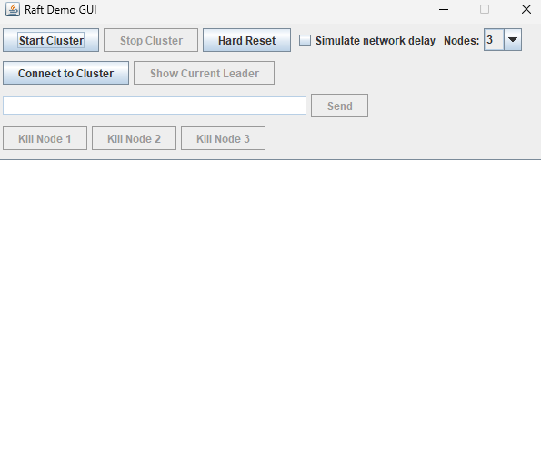
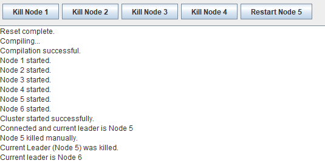

# COMP370 Project 2 — Group 3

**Mike Buss, Bhupinder Singh Gill, Armaan Kandola, Brayden Schneider, Eric Thai**

# Overview


Implement a distributed system. We are using the Raft consensus algorithm. The project provides a class for a Raft node with the standard roles (Follower, Candidate, Leader), leader election, and log replication. Each node is its own java program that can handle network communication: UDP for Raft (RequestVote, AppendEntries) and TCP for client requests.


## Screenshots

### Raft demo GUI



### Leader re-election (client view)



---

## Example log output

During normal operation, nodes log heartbeats, AppendEntries handling, and replication progress. In the logs below we see a packet recieved from the client ```127.0.0.1:9102``` and the cluster starting doing the process of appending it.

```
INFO: Resetting election timeout due to valid leader 2
Mar 26, 2026 9:47:58 P.M. raft_demo.RaftNode handleAppendEntries
INFO: Resetting election timeout due to valid leader 2
Mar 26, 2026 9:47:58 P.M. raft_demo.RaftServer lambda$start$0
INFO: Received packet from /127.0.0.1:9102 sent to handlePacket
Mar 26, 2026 9:47:58 P.M. raft_demo.RaftNode handleAppendEntries
INFO: Received heartbeat from Leader 2 (Term: 1)
Mar 26, 2026 9:47:58 P.M. raft_demo.RaftNode handleAppendEntries
INFO: Received heartbeat from Leader 2 (Term: 1)
Mar 26, 2026 9:47:58 P.M. raft_demo.RaftServer handlePacket
INFO: Handling AppendEntriesResults from /127.0.0.1:9102
Mar 26, 2026 9:47:58 P.M. raft_demo.RaftNode handleAppendEntries
INFO: AppendEntries from Leader 2 processed successfully
Mar 26, 2026 9:47:58 P.M. raft_demo.RaftNode handleAppendEntries
INFO: AppendEntries from Leader 2 processed successfully
Mar 26, 2026 9:47:58 P.M. raft_demo.RaftServer handleAppendEntriesResult
INFO: AppendEntries successful from node 1, updating matchIndex
Mar 26, 2026 9:47:58 P.M. raft_demo.RaftServer lambda$start$0
INFO: Received packet from /127.0.0.1:9105 sent to handlePacket
Mar 26, 2026 9:47:58 P.M. raft_demo.RaftServer handlePacket
INFO: Handling AppendEntriesResults from /127.0.0.1:9105
```

Logs are written under `logs/` when running.

---

## Set Up

### Prerequisites

- **Java 17** or higher (or a compatible JDK)
- **Bash** or **Command Prompt** (or alternative)

### Run the GUI

(1) (Linux/macOS):
   ```bash
   ./run_gui.sh
   ```
   If everything is working, the Raft Demo GUI window should open. Click Start Cluster, then Connect Client, and send a command to test.


(2) Windows:
   ```bat
   run_windows.bat
   ```
   Or just click the bat file in your file explorer. 

3.3. Headless run **---deprecated**
   ```bash
   ./run_headless.sh
   ```
## Project structure

```
COMP370-Project1-Group-3/
├── img/
├── src/raft_demo/
│   ├── RaftNode.java      # Raft roles, election, log
│   ├── RaftServer.java    # UDP/TCP networking
│   ├── RaftRPC.java       # RequestVote / AppendEntries 
│   ├── RaftConfig.java    # Cluster size limits, ports 
│   ├── NodeInfo.java      # Per-node host / UDP / TCP ports
│   ├── Client.java        
│   ├── Monitor.java       # singleton
│   ├── Observer.java      # Observer
│   └── GUI.java           # Swing UI
├── uml/                   # Diagrams
├── logs/                  # Runtime logs 
├── run_gui.sh
├── run_headless.sh
├── run_windows.bat
└── README.md
```

---

## Ports

Ports are defined in `RaftConfig` (base + node id):

| Purpose        | Formula              | Example (node 1) |
|----------------|----------------------|------------------|
| Raft RPC (UDP) | `9101 + nodeId`      | 9102             |
| Client (TCP)   | `8101 + nodeId`      | 8102             |

Valid cluster can be changed (see `RaftConfig.MIN_CLUSTER_SIZE` and `MAX_CLUSTER_SIZE`).

---

